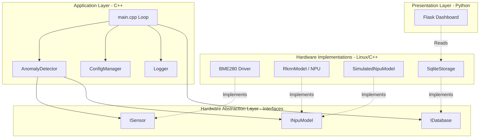

# System Architecture

## Core Philosophy
The system relies on a strictly layered architecture to separate business logic from hardware specifics, allowing for robust unit testing via Mock objects and execution on both x86 development machines and ARM64 production targets.

## Block Diagram: Separation of Concerns

## Layers
1. **Application Layer (C++):** Orchestrates data flow, manages thread pools, and handles timing loops. Contains the core business logic (`AnomalyDetector`).
2. **AI Inference Layer (C++):** Interfaces with the NPU using the RKNN C API to analyze data streams. Utilizes the Factory Pattern to seamlessly switch between hardware execution and local CPU simulation.
3. **Hardware Abstraction Layer (HAL) (C++):** - `ISensor`: Interface for environmental data collection (Implemented by `BME280`).
   - `IGPIO`: Interface for LED/Actuator control.
   - `INpuModel`: Interface for Edge AI anomaly detection.
   - `IDatabase`: Interface for local persistence (Implemented by `SqliteStorage`).
4. **Presentation Layer (Python):** A lightweight web server reading the SQLite DB to serve dashboards.

## Class Diagram: Dependency Injection & Patterns

## Web UI Architecture (Presentation Layer)

To keep the edge device lightweight, the presentation layer avoids heavy Node.js build steps (like React or Angular). Instead, it uses a decoupled **Vanilla JavaScript MVVM Stack** served by a lightweight Python REST API.

### Web Server (Flask API)
* **Responsibility:** Acts as the bridge between the SQLite database (written by the C++ backend) and the browser.
* **Design:** Strictly serves static HTML/CSS/JS files and provides stateless JSON API endpoints (`/api/data`, `/api/logs`). 
* **CORS & Live Preview:** Configured to allow Cross-Origin Resource Sharing (CORS), enabling developers to edit the UI in VS Code's "Live Preview" without needing to constantly restart the Python server.

### Frontend Pattern: MVVM (Model-View-ViewModel)
The JavaScript is strictly organized into the MVVM pattern to ensure maintainability:
1. **Model (`api.js`):** Handles all asynchronous `fetch()` calls to the Flask API. Includes a graceful fallback to simulated mock data if the API is offline, ensuring the UI can be developed independently of the backend.
2. **View (`ui.js`):** The only layer allowed to touch the DOM. It manages the Chart.js instance, updates the KPI Bento Grid, and handles CSS class toggles for the sidebar and navigation.
3. **ViewModel (`dashboard.js`):** The orchestrator. It holds the application state (e.g., current polling interval, data limits), listens to user events from the View, requests data from the Model, and passes the formatted results back to the View.

### UI/UX Design: ISA-101 Industrial Standard
The user interface is designed for physical edge deployments (touchscreens in industrial environments) following the **High-Performance HMI (ISA-101)** methodology:
* **Color by Exception:** The dashboard utilizes a muted, grayscale palette to reduce operator fatigue. Bright colors (Red, Orange) are strictly reserved for critical NPU anomaly alerts.
* **Bento Grid Layout:** Data is segmented into modular, highly legible cards. 
* **Touch-First Typography:** Form controls, navigation buttons, and spacing are deliberately oversized to accommodate operators wearing gloves.
* **Theming Engine:** The entire UI is driven by CSS Custom Properties (`:root` variables), allowing for instantaneous white-labeling or theme adjustments by changing just two base variables (`--hmi-bg-base` and `--hmi-accent-color`).