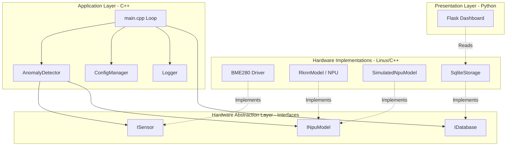
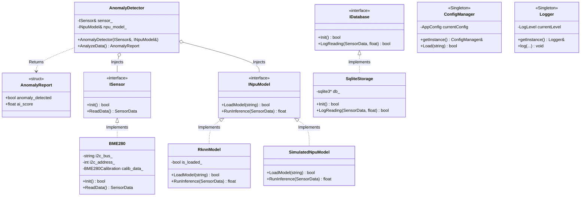

# System Architecture

## Core Philosophy
The system relies on a strictly layered architecture to separate business logic from hardware specifics, allowing for robust unit testing via Mock objects and execution on both x86 development machines and ARM64 production targets.

## Block Diagram: Separation of Concerns

## Layers
1. **Application Layer (C++):** Orchestrates data flow, manages thread pools, and handles timing loops. Contains the core business logic (`AnomalyDetector`).
2. **AI Inference Layer (C++):** Interfaces with the NPU using the RKNN C API to analyze data streams. Utilizes the Factory Pattern to seamlessly switch between hardware execution and local CPU simulation.
3. **Hardware Abstraction Layer (HAL) (C++):** - `ISensor`: Interface for environmental data collection (Implemented by `BME280`).
   - `IGPIO`: Interface for LED/Actuator control.
   - `INpuModel`: Interface for Edge AI anomaly detection.
   - `IDatabase`: Interface for local persistence (Implemented by `SqliteStorage`).
4. **Presentation Layer (Python):** A lightweight web server reading the SQLite DB to serve dashboards.

## Class Diagram: Dependency Injection & Patterns

